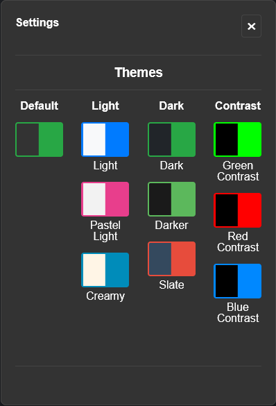

# 🐹 Hamster Destroyer

> This tool will help you automate the process of clicking/tapping the screen and will let you earn them coins even while being AFK.

 

# ❗Disclaimer

### Mimicking the real game process by automating it may be prohibited by the game's ToS! When installing this script, you willingly agree that you, and no one other than you take the responsibility of integrity of your in-game account.

 

### 📄 This tool includes:

  - A fancy and simple UI
  - The ability to start and stop the clicking process manually
  - The ability to terminate the UI and stop the script if needed

 

## 🔗 Installation

1. Install one of the extensions for running custom scripts:

    - [Tampermonkey](https://www.tampermonkey.net/) _(recommended)_
    - [Violentmonkey](https://violentmonkey.github.io/)
    - [Greasemonkey](https://www.greasespot.net/)
    - [Userscripts](https://github.com/quoid/userscripts)

2. Enable [developer mode in your browser](https://www.tampermonkey.net/faq.php?locale=en#Q209).

3. Install the script by going to [this link](https://update.greasyfork.org/scripts/507412/Hamster%20Destroyer.user.js). _(or download `Hamster Destroyer-1.3.1.user.js` from folder `userscript`) and install it manually)_

Done, now open the page of **Hamster Kombat** game directly in your browser and wait for it to fully load, after that the script will auto-launch itself.

> If the UI window doesn't appear, check if the script is installed correctly and restart your browser.

 

## 🔍 Showcase

### 👇 The main functionality of the script: you press a button - the magic happens.

 

### 🎨 Colors are also your tools! Choose a theme from the list of available ones.

 

## 🤝 Contribution
### If you're willing to contribute to this small project - be sure to do it! Any improvements and/or new useful features for this script are encouraged.
